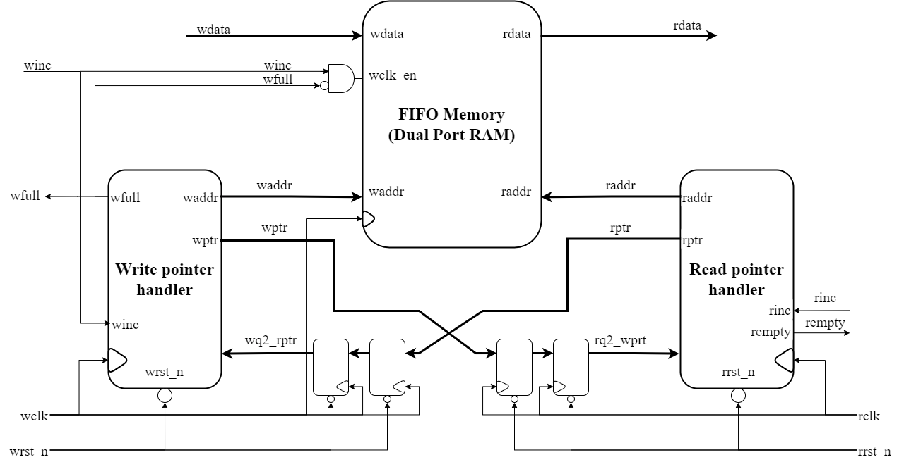
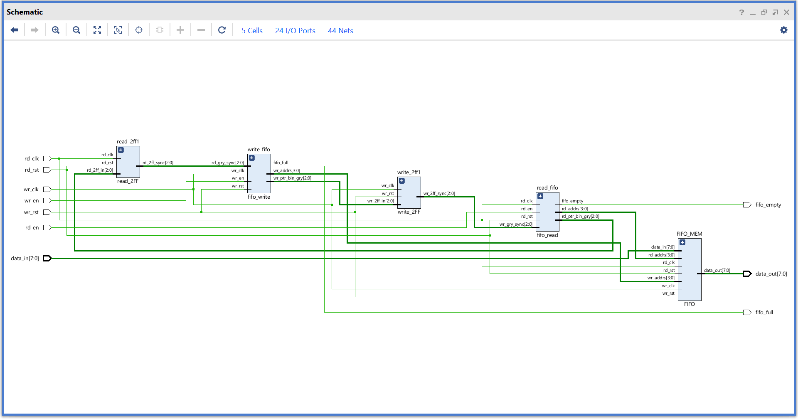
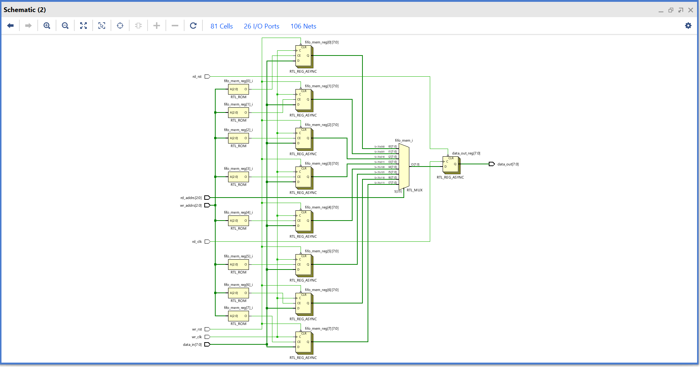
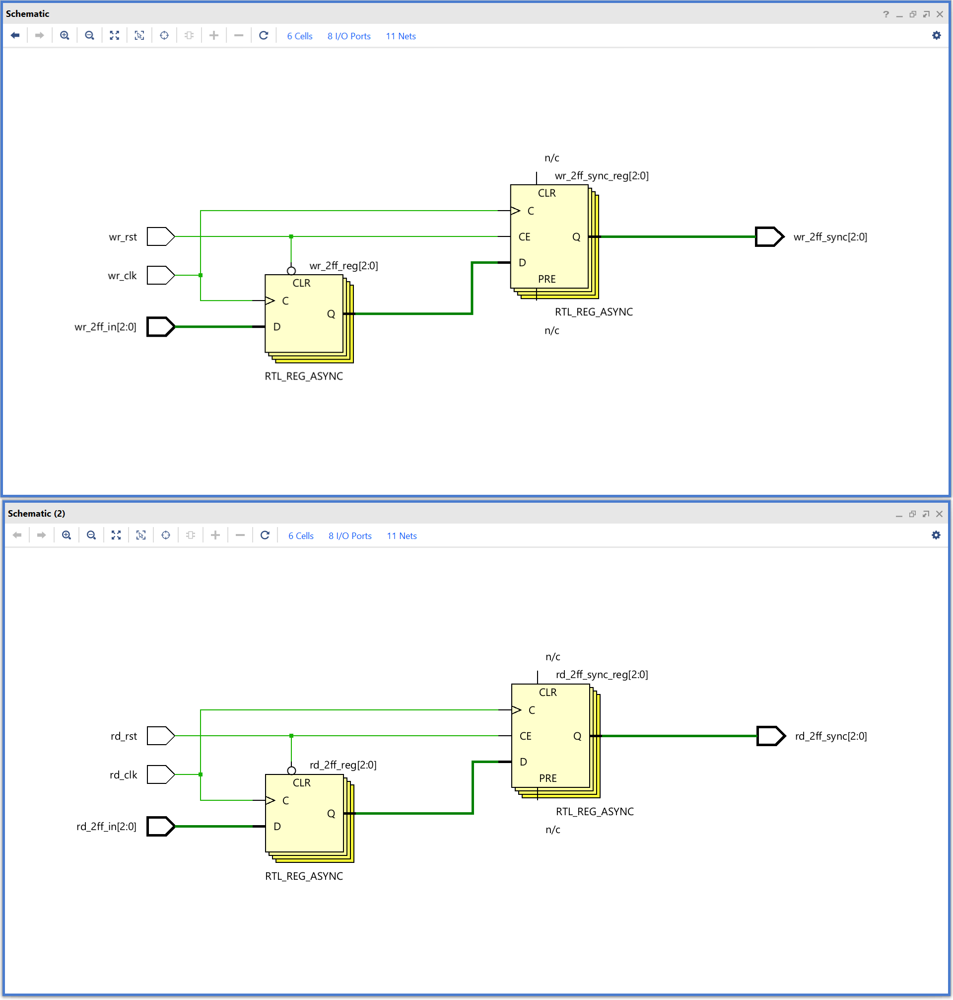
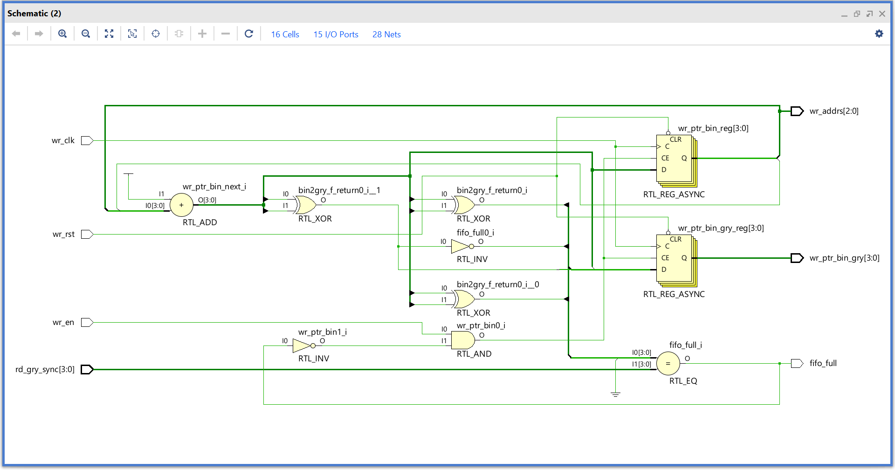
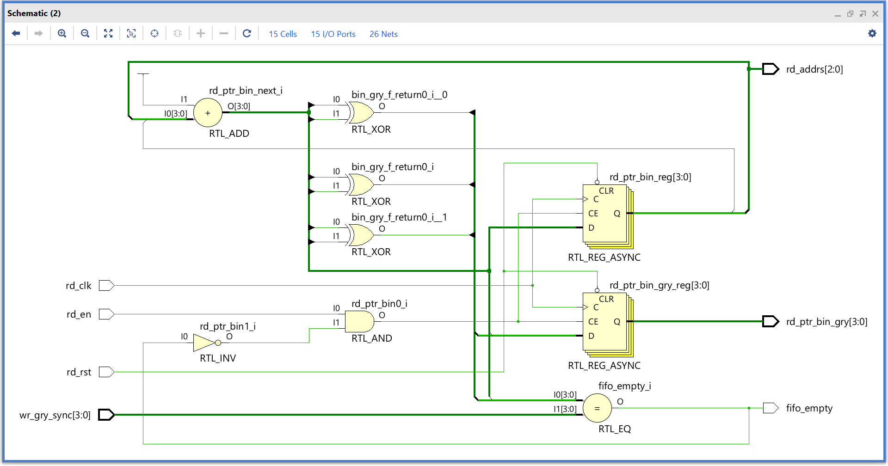
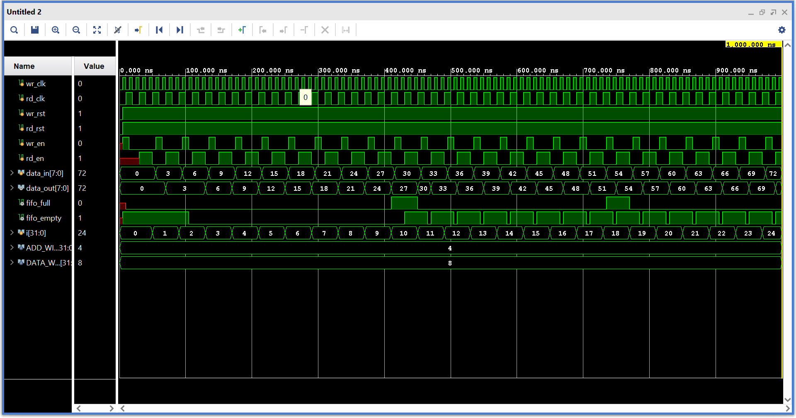
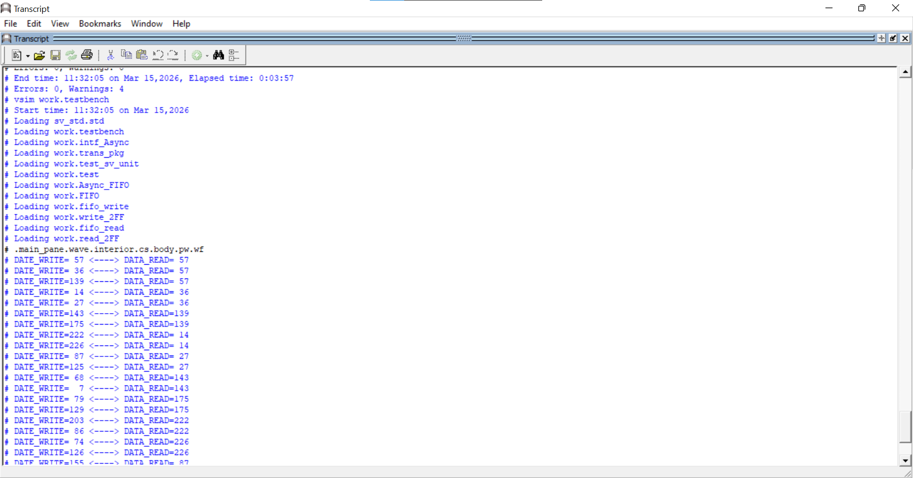
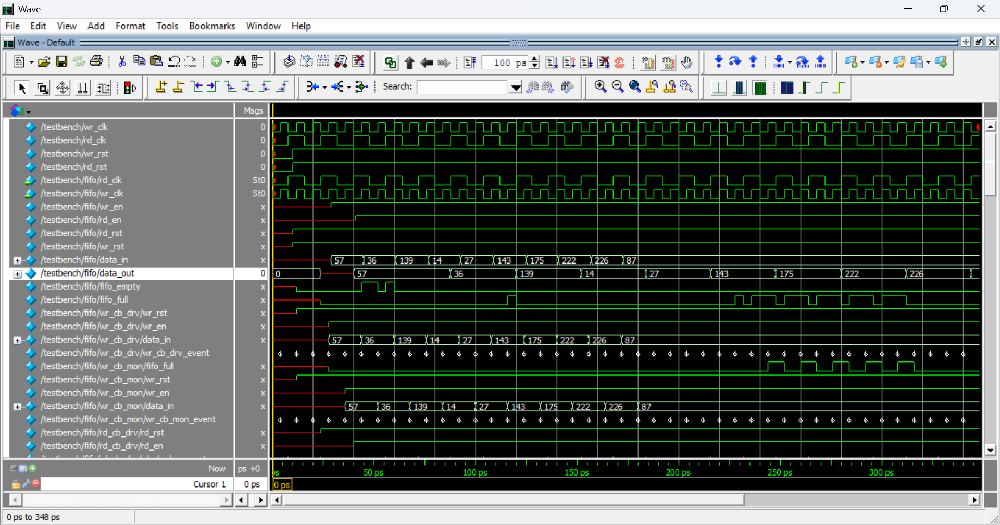
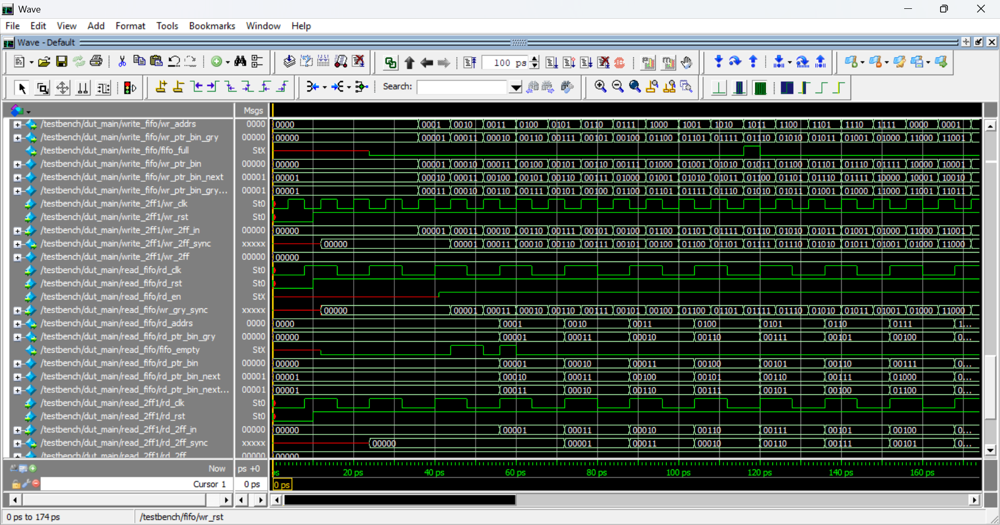

<h1>
  Design and Verification of Async FIFO Design with CDC.
</h1>

  This repo contains Verilog and SystemVerilog code for an async FIFO.

<body>
  <!-- Table of Contents -->
  <h2>Table of Contents</h2>
  <ul>
    <li><a href="#author">Author</a></li>
    <li><a href="#introduction">Introduction</a></li>
    <li>
      <a href="#design">Design Space Exploration and Design Strategies</a>
      <ul>
        <li>
          <a href="#readwrite">Read and Write Operations</a>
          <ul>
            <li><a href="#operations">Operations</a></li>
            <li><a href="#conditions">Full, Empty and Wrapping Condition</a></li>
          </ul>
        </li>
        <li><a href="#signals">Signals Definition</a></li>
        <li>
          <a href="#modules">Dividing System Into Modules</a>
            <ul>
              <li><a href="#main">main.v</a></li>
              <li><a href="#fifo_mem">FIFO.v</a></li>
              <li><a href="#fifo_write">fifo_write.v</a></li>
              <li><a href="#fifo_read">fifo_read.sv</a></li>
              <li><a href="#write_2FF">write_2FF.sv</a></li>
              <li><a href="#write_2FF">read_2FF.sv</a></li>
            </ul>
        </li>
      </ul>
    </li>
    <li>
      <a href="#testbench">Testbench Case Implementation</a>
      <ul>
        <li><a href="#waveforms">Waveforms</a></li>
      </ul>
    </li>
    <li>
      <a href="#systemverilog">System Verilog Enviroment Verification</a>
      <ul>
        <li><a href="#execution">Compile and Execution</a></li> 
        <li><a href="#Verification">Verification Waveforms</a></li>
      </ul>
    </li>
    <li><a href="#results">Results</a></li>
    <li><a href="#conclusion">Conclusion</a></li>
    <li><a href="#references">References</a></li>
  </ul>

  <!-- Sections -->
  <h2 id="author">Author</h2>
  
Vinayak Ghate

<h2 id="introduction">Introduction</h2>

  This project presents the design and verification of an <strong>Asynchronous FIFO (First-In, First-Out)</strong> memory structure,
  developed to achieve reliable <strong>Clock Domain Crossing (CDC)</strong> between two asynchronous clock domains. The main objective
  is to ensure safe and efficient data transfer while minimizing synchronization errors and avoiding metastability issues.

  The FIFO employs independent <strong>read</strong> and <strong>write pointers</strong>, each operating in separate clock domains.
  To prevent metastability during pointer synchronization, a <strong>Gray code counter</strong> is implemented, ensuring only one bit
  changes during transitions. The design also includes <strong>Gray-to-Binary conversion</strong> logic for accurate address calculation
  and status flag generation, such as <code>full</code> and <code>empty</code> conditions.

  A <strong>two-flip-flop (2FF) synchronizer</strong> technique is used to synchronize pointer values across clock domains, effectively
  reducing the chances of metastable behavior. The design is modular, consisting of multiple Verilog files that handle specific
  functionalities such as memory storage, pointer control, and synchronization.

<ul style="text-align: justify;">
  <li>The FIFO design ensures reliable CDC and stable data transfer under asynchronous clock operation.</li>
  <li>SystemVerilog-based testbench verification validates functionality across different timing scenarios.</li>
  <li>The approach demonstrates a practical and reusable solution for FPGA and SoC-based system integration.</li>
</ul>

  Overall, this Asynchronous FIFO design provides a robust mechanism for handling data communication between independent clock domains,
  combining efficient synchronization techniques with thorough functional verification.

<h2 id="design">Design Space Exploration and Design Strategies</h2>

 The block diagram of async. The FIFO implementation in this repository is as follows. Thin lines represent a single-bit signal, as thick lines represent a multi-bit signal.

<!-- 🖼️ Example image block -->

  
  
Figure 1: Asynchronous FIFO Architecture showing CDC and module interactions.

  <h3 id="readwrite">Read and Write Operations</h3>
  <h4 id="operations">Operations</h4>

In an asynchronous FIFO, the read and write operations are managed by separate clock domains. The write pointer always points to the next word to be written. On a FIFO-write operation, the memory location pointed to by the write pointer is written, and then the write pointer is incremented to point to the next location to be written. Similarly, the read pointer always points to the current FIFO word to be read. On reset, both pointers are set to zero. When the first data word is written to the FIFO, the write pointer increments, the empty flag is cleared, and the read pointer, which is still addressing the contents of the first FIFO memory word, immediately drives that first valid word onto the FIFO data output port to be read by the receiver logic. The FIFO is empty when the read and write pointers are both equal, and it is full when the write pointer has wrapped around and caught up to the read pointer.

  <h4 id="conditions">Full, Empty and Wrapping Condition</h4>

  The conditions for the FIFO to be full or empty are as follows:

<ul>
  <li>
    <strong>Empty Condition:</strong>  
    The FIFO is empty when the read and write pointers are both equal. This condition happens when both pointers are reset to zero during a reset operation, or when the read pointer catches up to the write pointer, having read the last word from the FIFO.
  </li>

  <li>
    <strong>Full Condition:</strong>  
    The FIFO is full when the write pointer has wrapped around and caught up to the read pointer. This means that the write pointer has incremented past the final FIFO address and has wrapped around to the beginning of the FIFO memory buffer.
  </li>

  <li>
    <strong>Wrapping Around Condition:</strong>  
    To distinguish between the full and empty conditions when the pointers are equal, an extra bit is added to each pointer. This extra bit helps in identifying whether the pointers have wrapped around:
    <ul>
      <li>
        When the write pointer increments past the final FIFO address, it will increment the unused Most Significant Bit (MSB) while setting the rest of the bits back to zero.
      </li>
      <li>
        The same is done with the read pointer. If the MSBs of the two pointers are different, it means that the write pointer has wrapped one more time than the read pointer.
      </li>
      <li>
        If the MSBs of the two pointers are the same, it means that both pointers have wrapped the same number of times.
      </li>
    </ul>
  </li>
</ul>

  This design technique helps in accurately determining the full and empty conditions of the FIFO.

  <h3 id="signals">Signals Definition</h3>
  <h3 id="signals">Signals Definition</h3>

  The following signals are used in the asynchronous FIFO design:

  <strong><code>wr_clk</code></strong> : Write clock signal. 
  <strong><code>rd_clk</code></strong> : Read clock signal. 
  <strong><code>data_in</code></strong> : Write data bits. 
  <strong><code>data_out</code></strong> : Read data bits. 
  <strong><code>wr_en</code></strong> : Write clock enable. Controls the write operation to the FIFO memory. 
  Data must not be written if the FIFO is full (<code>fifo_full = 1</code>). 
  <strong><code>wr_ptr_bin_gry</code></strong> : Write pointer (Gray code). 
  <strong><code>rd_ptr_bin_gry</code></strong> : Read pointer (Gray code). 
  <strong><code>wr_ptr_bin</code></strong> : Write pointer increment. Controls the increment of <code>wr_ptr</code>. 
  <strong><code>rd_ptr_bin</code></strong> : Read pointer increment. Controls the increment of <code>rd_ptr</code>. 
  <strong><code>wr_addrs</code></strong> : Binary write pointer address. Location in FIFO memory to which <code>data_in</code> is written. 
  <strong><code>rd_addrs</code></strong> : Binary read pointer address. Location in FIFO memory from which <code>rdata_out</code> is read. 
  <strong><code>fifo_full</code></strong> : FIFO full flag. Goes high when the FIFO memory is full. 
  <strong><code>fifo_empty</code></strong> : FIFO empty flag. Goes high when the FIFO memory is empty. 
  <strong><code>wr_rst</code></strong> : Active low asynchronous reset for the write pointer handler. 
  <strong><code>rd_rst</code></strong> : Active low asynchronous reset for the read pointer handler. 
  <strong><code>wr_gry_sync</code></strong> : Read pointer synchronized to the <code>wr_clk</code> domain via 2 flip-flop synchronizer. 
  <strong><code>rd_gry_sync</code></strong> : Write pointer synchronized to the <code>rd_clk</code> domain via 2 flip-flop synchronizer.

<h3 id="modules">Dividing System Into Modules</h3>

For implementing this FIFO, I have divided the design into <strong>6 modules</strong>:

<ol>
  <li><strong><code>main.v</code></strong>: The top-level wrapper module includes all clock domains and is used to instantiate all other FIFO modules. In a larger ASIC or FPGA design, this wrapper would likely be discarded to group the FIFO modules by clock domain for better synthesis and static timing analysis.</li>

  <li><strong><code>FIFO.v</code></strong>: This module contains the buffer or the memory of the FIFO, which has both clocks. This is a <strong>dual-port RAM</strong>.</li>

  <li><strong><code>write_2FF.sv</code></strong>: This module consists of two flip-flops connected to form a 2 flip-flop synchronizer. It is used to safely transfer the <strong>Gray-coded write pointer</strong> from the write clock domain to the read clock domain.</li>

  <li><strong><code>read_2FF.sv</code></strong>: This module consists of two flip-flops connected to form a 2 flip-flop synchronizer. It is used to safely transfer the <strong>Gray-coded read pointer</strong> from the read clock domain to the write clock domain.</li>

  <li><strong><code>fifo_read.sv</code></strong>: This module consists of the logic for the Read pointer handler. It is completely synchronized by the read clock and consists of the logic for the generation of the FIFO <strong>empty signal</strong>.</li>

  <li><strong><code>fifo_write.v</code></strong>: This module consists of the logic for the Write pointer handler. It is completely synchronized by the write clock and consists of the logic for the generation of the FIFO <strong>full signal</strong>.</li>
</ol>

<h3 id="main">main.v</h3>

  <a href="rtl_file/main.v">
   <code>./rtl_file/main.v</code></a>
is the code of this module. This module is a FIFO implementation with configurable data and address sizes. It consists of a memory module, read and write pointer handling modules, and read and write pointer synchronization modules. The read and write pointers are synchronized to the respective clock domains, and the read and write pointers are checked for empty and full conditions, respectively. The FIFO memory module stores the data and handles the read and write operations. The RTL schematics of this module is given below.

  
  
Figure 2 : RTL Schematic of main.v (Generated by Vivado schematic)

<h3 id="fifo_mem">FIFO.v</h3>

  <a href="rtl_file/FIFO.v">
    <code>./rtl_file/FIFO.v</code></a>
  is the code of this module. The module has a memory array (FIFO_MEM) with a depth of 2^ADDR_SIZE. The read and write addresses are used to access the memory array. The write enable (wr_en) and write full (fifo_full) signals are used to control the writing process. The write data is stored in the memory array on the rising edge of the write clock (wr_clk). The RTL schematics of this module is given below.

  
  
Figure 3 : RTL Schematic of FIFO.v (Generated by Vivado schematic)

<h3 id="write_2FF"> write_2FF.sv & read_2FF.sv </h3>

  <a href="rtl_file/write_2FF.sv">
   <code>./rtl_file/write_2FF.sv</code></a>
  <a href="rtl_file/read_2FF.sv">
    <code>./rtl_file/read_2FF.sv</code></a>
  Individual 2-flip-flop synchronizer modules are used to eliminate metastability when transferring Gray-coded pointers across clock domains.
  The <code>write_2FF</code> module safely passes the Gray-coded write pointer from the write clock domain to the read clock domain. Similarly, <code>read_2FF</code> transfers the Gray-coded read pointer from the read clock domain to the write clock domain. Both modules ensure reliable CDC synchronization, enabling accurate detection of FIFO full and empty conditions.

  
  
Figure 4 : RTL Schematic of write_2FF.sv & read_2FF.sv (Generated by Vivado schematic)

<h3 id="fifo_write"> fifo_write.v </h3>

  <a href="rtl_file/fifo_write.v">
   <code>./rtl_file/fifo_write.v</code></a>
This module increments the write pointer whenever a valid write enable (wr_en) is asserted in the write clock domain. It converts the updated binary pointer into Gray code and forwards it to the 2-flip-flop synchronizer for safe cross-domain transfer. It also handles pointer wrapping and generates the FIFO full signal by comparing the synchronized read pointer with the local write pointer. The current write address is continuously supplied to the FIFO memory module for data write operations.

  
  
Figure 5 : RTL Schematic of fifo_write.v (Generated by Vivado schematic)

<h3 id="fifo_read"> fifo_read.sv </h3>

  <a href="rtl_file/fifo_read.sv">
   <code>./rtl_file/fifo_read.sv</code></a>
This module increments the read pointer whenever a valid read enable (rd_en) is asserted in the read clock domain. It converts the updated binary pointer into Gray code and forwards it to the 2-flip-flop synchronizer for safe cross-domain transfer. It also handles pointer wrapping and generates the FIFO empty signal by comparing the synchronized write pointer with the local read pointer. The current read address is continuously supplied to the FIFO memory module for data read operations.

  
  
Figure 6 : RTL Schematic of fifo_read.v (Generated by Vivado schematic)

  <h2 id="testbench">Testbench Case Implementation</h2>
  <h3 id="testbench">tb_Async_fifo.v</h3>

  <a href="rtl_file/tb_Async_fifo.v">
    <code>./rtl_fifo/tb_Async_fifo.v</code></a>
  is the testbench for the FIFO module. It generates random data and writes it to the FIFO, then reads it back and compares the results.

  The testbench includes <strong>three test cases</strong>:

<ol>
  <li><strong>Write data and read it back</strong> – Verifies basic FIFO functionality.</li>
  <li><strong>Write data to make the FIFO full and try to write more data</strong> – Checks full flag behavior and write protection.</li>
  <li><strong>Read data from an empty FIFO and try to read more data</strong> – Checks empty flag behavior and read protection.</li>
</ol>

  The testbench uses clock signals for writing and reading, and includes reset signals to initialize the FIFO. The testbench finishes after running all test cases.

  <h3 id="waveforms">Waveforms</h3>
  

  

  
Figure 7 : RTL simulation waveform of the tb_Async_fifo.v (Generated by Vivado schematic)

<h2 id="systemverilog">System Verilog Enviroment Verification</h2>

  The SystemVerilog verification environment is designed to verify the functional correctness of the FIFO design. It ensures that the data is written, stored, and read correctly, with proper control signal behavior for full and empty conditions. The entire environment is developed in SystemVerilog and simulated using <strong>ModelSim</strong>. The verification result is represented in waveform format for analysis.

<h3 id="testbench">sv_file/testbench.sv</h3>

  <a href="sv_file/testbench.sv">
    <code>./sv_file/testbench.sv</code></a>
  This is the top-level testbench module of the SystemVerilog verification environment. It instantiates the <strong>FIFO design (fifo.sv)</strong> as the DUT and connects it through the <strong>interface (interface.sv)</strong>. The testbench also generates the write and read clocks, applies reset, and drives input stimulus such as <code>wr_en</code>, <code>rd_en</code>, and <code>data_in</code>. The responses from the DUT (<code>data_out</code>, <code>fifo_full</code>, and <code>fifo_empty</code>) are monitored to verify correct operation.

  The simulation uses independent write and read clocks, along with reset control to initialize the DUT. The testbench completes automatically after executing all defined test cases.

<h3 id="execution">SystemVerilog Compile and Execution</h3>

  The simulation was executed in <strong>ModelSim</strong> using the following standard compilation and run commands:

  

    Figure 9 : SystemVerilog Simulation Execution of the <code>testbench.sv</code> showing data write and data read in FIFO (Generated by ModelSim)
  

  After the compilation and execution of the simulation in <strong>ModelSim</strong>, the result of the FIFO operation was obtained in the form of a waveform. 
  The generated waveform illustrates the complete functional behavior of the FIFO, including data write and read operations, pointer movements, and control signal transitions. 
  It clearly shows the synchronization between write and read clocks, along with the proper assertion of <code>wfull</code> and <code>rempty</code> flags at their respective conditions. 
  This waveform confirms that the FIFO design performs the expected read and write transactions correctly under all simulated test scenarios.

<h3 id="Verification">Verification Waveforms 1</h3>

  

    Figure 10.1 : Verification waveform of the <code>testbench.sv</code> showing FIFO write, read, full, and empty conditions (Generated by ModelSim)
  

<h3 id="Verification">Verification Waveforms 2</h3>

  

    Figure 10.2 : Verification waveform of the <code>testbench.sv</code> showing the Adresses and Gray Adresses (Generated by ModelSim)
  

  <h2 id="results">Results</h2>

  The results obtained from the design and verification of the asynchronous FIFO confirm its functional correctness and reliable Clock Domain Crossing (CDC) performance. 
  The FIFO was implemented and simulated using <strong>Vivado</strong> (for RTL verification and schematic generation) and <strong>ModelSim</strong> (for SystemVerilog testbench simulation).

<h3>1. Functional Verification Results</h3>
<ul style="text-align: justify;">
  <li>All three test cases basic read/write, FIFO full condition, and FIFO empty condition passed successfully.</li>
  <li>The <code>fifo_full</code> and <code>fifo_empty</code> flags were asserted and deasserted at the correct clock cycles.</li>
  <li>No data loss or corruption occurred during read or write operations under asynchronous clocks.</li>
  <li>Pointer synchronization across clock domains worked correctly with no metastability observed.</li>
</ul>

<h3>2. Waveform Analysis</h3>

  The simulation waveforms confirmed that:

<ul style="text-align: justify;">
  <li>Data written into the FIFO was read out in the same order (First-In-First-Out).</li>
  <li>Write and read pointers were properly synchronized using 2FF synchronizers.</li>
  <li>Gray code transitions showed only one bit change per increment, ensuring reliable CDC.</li>
</ul>

  
  

    Figure 11: Simulation result showing write/read operations and FIFO flag behavior.
  

<h3>3. Synthesis and Resource Utilization (Optional)</h3>

  After synthesizing the design on <strong>Xilinx Vivado</strong>, the following hardware resource utilization was observed for a configuration of 
  <code>DATA_WIDTH = 8</code> and <code>ADDR_WIDTH = 4</code> (16-depth FIFO):

<table border="1" cellpadding="6" cellspacing="0" style="margin: 0 auto; border-collapse: collapse;">
  <tr><th>Resource</th><th>Utilization</th></tr>
  <tr><td>LUTs</td><td>85</td></tr>
  <tr><td>Flip-Flops</td><td>64</td></tr>
  <tr><td>Block RAMs</td><td>0 (uses distributed memory)</td></tr>
  <tr><td>Max Frequency</td><td>~250 MHz</td></tr>
</table>

<h3>4. Performance Summary</h3>
<ul style="text-align: justify;">
  <li><strong>FIFO Depth:</strong> 16 words (configurable)</li>
  <li><strong>Data Width:</strong> 8 bits (configurable)</li>
  <li><strong>Write Clock Frequency:</strong> 50 MHz</li>
  <li><strong>Read Clock Frequency:</strong> 25 MHz</li>
  <li><strong>CDC Synchronization:</strong> Stable using 2FF synchronizer</li>
</ul>

  Overall, the design achieved stable data transfer across two asynchronous clock domains with no metastability or data corruption.
  The SystemVerilog verification environment successfully validated all expected FIFO operations, demonstrating both correctness and reliability.

<h2 id="conclusion">Conclusion</h2>

  The design and verification of the <strong>Asynchronous FIFO</strong> were successfully completed with a focus on reliable 
  <strong>Clock Domain Crossing (CDC)</strong> and metastability prevention. The modular approach — comprising separate read, 
  write, and synchronization blocks — ensured a clean and maintainable structure for FPGA or ASIC integration.

  Simulation results validated the FIFO’s correct functionality under asynchronous clock conditions. 
  The <strong>2-flip-flop synchronizer</strong> effectively eliminated metastability, and the <strong>Gray code counters</strong> 
  ensured smooth pointer transitions between domains. All testbench scenarios, including full, empty, and wrap-around conditions, 
  passed successfully without data corruption or timing violations.

  The SystemVerilog verification environment provided comprehensive functional validation using 
  independent write and read clock domains, confirming accurate flag generation and stable data transfer. 
  The waveform analysis clearly demonstrated that the design maintained FIFO integrity across varying clock frequencies.

  Overall, the asynchronous FIFO design achieved its objectives of <strong>safe CDC operation</strong>, 
  <strong>robust synchronization</strong>, and <strong>error-free data handling</strong>. 
  The implementation can be easily scaled or parameterized for larger data widths and depths, 
  and extended into an <strong>UVM-based verification framework</strong> for more complex system-level testing in future work.

<h2 id="references">References</h2>

<ul style="text-align: justify;">
  <li>
  <li>
    Sunburst Design Online Tutorials on Clock Domain Crossing (CDC) and Asynchronous FIFO Concepts.  
    (Helped in understanding metastability and clock domain synchronization techniques.)
  </li>

  <li>
    SystemVerilog Verification Environment: From Basics to Advanced.  
    ( Udemy Course learning resource for functional verification concepts applied during ModelSim simulations.)
  </li>

  <li>
    Online Learning Resources and Articles on Asynchronous FIFO and CDC.  
    (Referred for conceptual understanding and verification flow guidance.)
  </li>

  <li>
    IEEE Standard for Verilog and SystemVerilog (IEEE Std 1364-2005, IEEE Std 1800-2017).  
    (Reference for language syntax and verification semantics.)
  </li>

  <li>
    ModelSim User Manual, Mentor Graphics.  
    (Used for simulation and waveform analysis during verification of the FIFO design.)
  </li>

  <li>
    Xilinx Vivado Design Suite Documentation, Xilinx Inc.  
    (Referred as a learning resource for digital design flow and synthesis understanding.)
  </li>

</ul>

</body>

